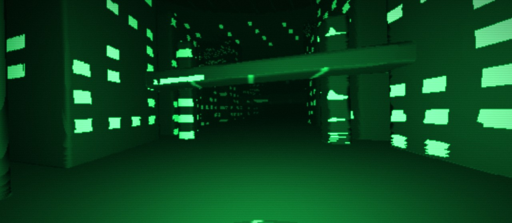

正直に最初に言っておくと、私はコードがほとんど書けません。

それでもこの数日で、**ブラウザで動くインタラクティブアート**を4つ作って、ネットに公開しました。マウスで触ると反応する、ちゃんと「動く」やつです。

全部、AI（Claude）と一緒に作りました。今回はその体験を、専門用語なしで紹介します。「自分には無理」と思っている人にこそ読んでほしい話です。

---

## 「作りたいもの」を言葉で伝えるだけ

やったことはシンプルで、**作りたいイメージを言葉でAIに伝える**。それだけです。

「レイマーチングで洞窟を飛ぶ作品が作りたい」
「これだと感動が薄いな、もっと派手にして」
「煙っぽいから、もっと濃いインクっぽくして」

こんな感じで、出てきたものを見て「ここをこう直して」を繰り返す。私の役割は**コードを書くことではなく、方向を決めること**でした。

絵を描けなくても「こういう絵が欲しい」と言えるように、コードが書けなくても「こういう動きが欲しい」と言えれば、形になっていく。これが想像以上に楽しかったです。

---

## 実際に作った4作品

せっかくなので全部リンクを貼っておきます。スマホよりパソコンのほうが快適です。

### 1. PIXEL TOWN（落ちて、砕ける）

クリックするとピクセルのビルが落ちてきて、着地の衝撃で砕けて瓦礫が積み上がる作品。最初に作ったやつです。

👉 [PIXEL TOWN を見る](https://16bit-chill.github.io/pixel-ink/)

### 2. LUMEN（地底をどこまでも飛ぶ）

光の差し込む地底世界を、ひたすら飛んでいく作品。天井の穴から光が落ちて、地底湖に反射する。音も全部その場で生成しています。ヘッドホン推奨です。

👉 [LUMEN を見る](https://16bit-chill.github.io/lumen/)

### 3. CIPHER（世界の正体はコードだった）

緑に光る電脳都市を飛んでいくと…画面をクリックした瞬間、世界がぜんぶコードに変わります。マトリックスのあのシーンをやりたかっただけ、とも言います。

👉 [CIPHER を見る](https://16bit-chill.github.io/cipher/)

### 4. PLUME（色をぶちまけて遊ぶ）

マウスでぐりぐりすると、色のインクがブワッと広がって混ざり合う作品。意味はないけど、なんだか気持ちいい。これが一番「触って楽しい」と思います。

👉 [PLUME を見る](https://16bit-chill.github.io/plume/)

---

## やってみて分かった3つのこと

### 1. 「ゼロから」じゃなくていい

何もないところから作るのではなく、**AIが出したものに反応していく**形なので、ハードルがぐっと下がります。「これいいね」「これは違う」を言えれば前に進みます。

### 2. 妥協しないほうが面白くなる

一発でいいものは出ません。「20点だな」「60点になった」と正直に伝えて何度も直すうちに、自分でも驚くものになっていきました。**遠慮せずダメ出しするのがコツ**です。

### 3. 「実物」は強い

文章で「AIすごい」と言うより、**触れる実物が1つある**ほうが何倍も伝わります。作ったものをそのまま人に見せられるのは、大きな武器だと感じました。

---

## まとめ

- コードが書けなくても、AIと一緒なら「動く作品」は作れる
- 自分の役割は、コードを書くことではなく**方向を決めること**
- うまくいくコツは「正直にダメ出しを繰り返す」こと
- 文章より、触れる「実物」のほうが伝わる

「自分には技術がないから無理」と思っている方こそ、一度AIと何か作ってみてほしいです。作れる範囲が、思っているより広がっています。

---

## 関連記事

- [Claudeの最新モデル「Fable 5」が登場。“仕事を預けられるAI”になっていた](/posts/claude-fable-5-review/)
- [AIを使った副業、初心者におすすめの3つの始め方](/posts/ai-side-job-beginners/)
- [HP制作代行「Clavis Studio」をはじめました【ポートフォリオ公開】](/posts/clavis-studio-portfolio/)
